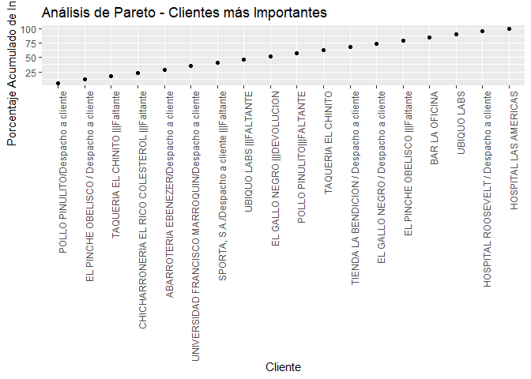
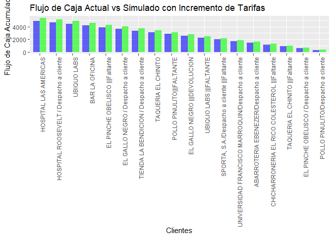
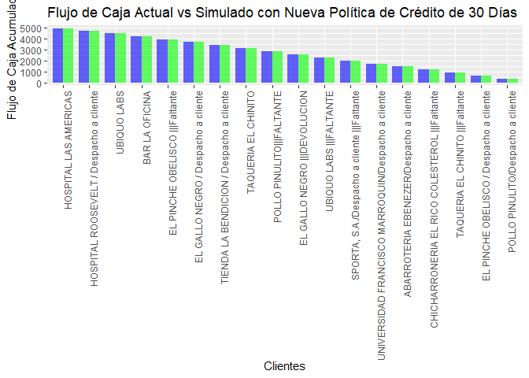

Análisis Financiero del Flujo de Caja
================
Distribuidora del Sur, S.A.

``` r
library(ggplot2)
```

    ## Warning: package 'ggplot2' was built under R version 4.3.3

``` r
library(readr)
```

    ## Warning: package 'readr' was built under R version 4.3.3

``` r
library(knitr)
```

    ## Warning: package 'knitr' was built under R version 4.3.3

``` r
library(dplyr)
```

    ## 
    ## Attaching package: 'dplyr'

    ## The following objects are masked from 'package:stats':
    ## 
    ##     filter, lag

    ## The following objects are masked from 'package:base':
    ## 
    ##     intersect, setdiff, setequal, union

``` r
data <- read_csv("C:/Users/barri/Documents/UFM/2024/Segundo Semestre/Data Wrangling/Analisis de Flujo de Caja y Gestión/tabla_completa.csv", locale = locale(encoding = "latin1"))
```

    ## New names:
    ## Rows: 2180 Columns: 11
    ## ── Column specification
    ## ──────────────────────────────────────────────────────── Delimiter: "," chr
    ## (4): CLIENTE, PILOTO, UNIDAD, MES dbl (7): ...1, COD_VIAJE, UBICACION,
    ## CANTIDAD, Q, CREDITO, ANIO
    ## ℹ Use `spec()` to retrieve the full column specification for this data. ℹ
    ## Specify the column types or set `show_col_types = FALSE` to quiet this message.
    ## • `` -> `...1`

``` r
flujo_caja <- data %>%
  group_by(CLIENTE) %>%
  summarise(
    Dias_de_Credito_Promedio = mean(CREDITO, na.rm = TRUE),
    Ingreso_Promedio = mean(Q, na.rm = TRUE)
  ) %>%
  arrange(desc(Ingreso_Promedio)) %>%
  mutate(Flujo_de_Caja_Acumulado = cumsum(Ingreso_Promedio))
```

``` r
# Calcular el flujo de caja acumulado por cliente
flujo_caja <- data %>%
  group_by(CLIENTE) %>%
  summarise(
    Dias_de_Credito_Promedio = mean(CREDITO, na.rm = TRUE),
    Ingreso_Promedio = mean(Q, na.rm = TRUE)
  ) %>%
  arrange(desc(Ingreso_Promedio)) %>%
  mutate(Flujo_de_Caja_Acumulado = cumsum(Ingreso_Promedio))

# Resumen estadístico de los ingresos
summary(flujo_caja$Ingreso_Promedio)
```

    ##    Min. 1st Qu.  Median    Mean 3rd Qu.    Max. 
    ##   244.4   268.7   277.6   274.4   283.3   294.5

``` r
# Gráfico de caja y bigotes de ingresos
ggplot(flujo_caja, aes(x = "", y = Ingreso_Promedio)) +
    geom_boxplot(fill = "skyblue") +
    labs(title = "Distribución de Ingresos por Cliente", y = "Ingreso Promedio") +
    theme_minimal()
```

<!-- -->

``` r
# Gráfico de ingresos acumulados
ggplot(flujo_caja, aes(x = reorder(CLIENTE, Ingreso_Promedio), y = Ingreso_Promedio)) +
    geom_bar(stat = "identity", fill = "darkblue") +
    labs(title = "Ingresos Acumulados por Cliente", x = "Clientes", y = "Ingreso Promedio") +
    theme(axis.text.x = element_text(angle = 90, hjust = 1))
```

<!-- -->

``` r
# Desempeño de pilotos por viajes
pilotos_desempeno <- data %>%
  group_by(PILOTO) %>%
  summarise(Viajes_Completados = n(), Ingreso_Total = sum(Q), Ingreso_Promedio = mean(Q))

# Mostrar la tabla de desempeño de pilotos
kable(pilotos_desempeno, col.names = c("Piloto", "Viajes Completados", "Ingreso Total", "Ingreso Promedio"))
```

| Piloto                        | Viajes Completados | Ingreso Total | Ingreso Promedio |
|:------------------------------|-------------------:|--------------:|-----------------:|
| Angel Valdez Alegria          |                235 |      64307.50 |         273.6489 |
| Felipe Villatoro              |                247 |      64626.50 |         261.6457 |
| Fernando Mariano Berrio       |                267 |      77097.25 |         288.7537 |
| Hector Aragones Frutos        |                248 |      66645.25 |         268.7308 |
| Hector Giron                  |                228 |      62955.25 |         276.1195 |
| Ismael Rodero Monteagudo      |                244 |      70936.50 |         290.7234 |
| Juan Francisco Portillo Gomez |                212 |      58347.25 |         275.2229 |
| Luis Jaime Urbano             |                246 |      65992.25 |         268.2612 |
| Pedro Alvarez Parejo          |                253 |      67940.50 |         268.5395 |

``` r
# Desempeño de vehículos
vehiculos_desempeno <- data %>%
  group_by(UNIDAD) %>%
  summarise(Viajes_Completados = n(), Ingreso_Total = sum(Q), Ingreso_Promedio = mean(Q))

# Mostrar la tabla de desempeño de vehículos
kable(vehiculos_desempeno, col.names = c("Vehículo", "Viajes Completados", "Ingreso Total", "Ingreso Promedio"))
```

| Vehículo       | Viajes Completados | Ingreso Total | Ingreso Promedio |
|:---------------|-------------------:|--------------:|-----------------:|
| Camion Grande  |               1211 |      455466.5 |         376.1078 |
| Camion Pequeño |                605 |      112815.2 |         186.4715 |
| Panel          |                364 |       30566.5 |          83.9739 |

``` r
# Gráfico de desempeño de vehículos
ggplot(vehiculos_desempeno, aes(x = reorder(UNIDAD, -Ingreso_Total), y = Ingreso_Total)) +
  geom_bar(stat = "identity", fill = "steelblue") +
  labs(title = "Desempeño de Vehículos", x = "Vehículo", y = "Ingreso Total") +
  theme(axis.text.x = element_text(angle = 90, hjust = 1))
```

<!-- -->

``` r
# Análisis de Pareto de clientes
pareto_agg <- flujo_caja %>%
  arrange(desc(Ingreso_Promedio)) %>%
  mutate(Cumulative_Risk = cumsum(Ingreso_Promedio) / sum(Ingreso_Promedio) * 100)

# Gráfico de Pareto - Clientes más importantes
ggplot(pareto_agg, aes(x = reorder(CLIENTE, -Ingreso_Promedio), y = Cumulative_Risk)) +
  geom_line(color = "blue", size = 1) +
  geom_point() +
  labs(title = "Análisis de Pareto - Clientes más Importantes", x = "Cliente", y = "Porcentaje Acumulado de Ingresos") +
  theme(axis.text.x = element_text(angle = 90, hjust = 1))
```

    ## Warning: Using `size` aesthetic for lines was deprecated in ggplot2 3.4.0.
    ## ℹ Please use `linewidth` instead.
    ## This warning is displayed once every 8 hours.
    ## Call `lifecycle::last_lifecycle_warnings()` to see where this warning was
    ## generated.

    ## `geom_line()`: Each group consists of only one observation.
    ## ℹ Do you need to adjust the group aesthetic?

<!-- -->

``` r
# Clasificar clientes en niveles de riesgo según días de crédito
flujo_caja$Nivel_Riesgo <- cut(flujo_caja$Dias_de_Credito_Promedio, 
                               breaks = c(-Inf, 30, 60, Inf), 
                               labels = c("Bajo", "Medio", "Alto"))

# Simulación del impacto si los clientes de alto riesgo no pagan
flujo_caja$Ingreso_Simulado <- ifelse(flujo_caja$Nivel_Riesgo == "Alto", 0, flujo_caja$Ingreso_Promedio)
flujo_caja$Flujo_Caja_Simulado <- cumsum(flujo_caja$Ingreso_Simulado)

# Mostrar la tabla con los ingresos simulados
kable(flujo_caja[, c("CLIENTE", "Ingreso_Promedio", "Ingreso_Simulado", "Flujo_de_Caja_Acumulado", "Flujo_Caja_Simulado")],
      col.names = c("Cliente", "Ingreso Promedio", "Ingreso Simulado", "Flujo de Caja Acumulado", "Flujo de Caja Simulado"),
      caption = "Simulación del Impacto en el Flujo de Caja si los Clientes de Alto Riesgo no Pagan")
```

| Cliente                                            | Ingreso Promedio | Ingreso Simulado | Flujo de Caja Acumulado | Flujo de Caja Simulado |
|:---------------------------------------------------|-----------------:|-----------------:|------------------------:|-----------------------:|
| POLLO PINULITO/Despacho a cliente                  |         294.4954 |         294.4954 |                294.4954 |               294.4954 |
| EL PINCHE OBELISCO / Despacho a cliente            |         289.0650 |         289.0650 |                583.5605 |               583.5605 |
| TAQUERIA EL CHINITO \|\|\|Faltante                 |         285.7546 |         285.7546 |                869.3151 |               869.3151 |
| CHICHARRONERIA EL RICO COLESTEROL \|\|\|Faltante   |         284.7039 |           0.0000 |               1154.0190 |               869.3151 |
| ABARROTERIA EBENEZER/Despacho a cliente            |         283.4275 |         283.4275 |               1437.4465 |              1152.7426 |
| UNIVERSIDAD FRANCISCO MARROQUIN/Despacho a cliente |         282.7556 |         282.7556 |               1720.2021 |              1435.4982 |
| SPORTA, S.A./Despacho a cliente \|\|\|Faltante     |         282.1310 |           0.0000 |               2002.3332 |              1435.4982 |
| UBIQUO LABS \|\|\|FALTANTE                         |         281.7982 |           0.0000 |               2284.1314 |              1435.4982 |
| EL GALLO NEGRO \|\|\|DEVOLUCION                    |         277.9034 |         277.9034 |               2562.0348 |              1713.4015 |
| POLLO PINULITO\|\|\|FALTANTE                       |         277.3571 |         277.3571 |               2839.3919 |              1990.7587 |
| TAQUERIA EL CHINITO                                |         275.3525 |         275.3525 |               3114.7444 |              2266.1112 |
| TIENDA LA BENDICION / Despacho a cliente           |         273.9380 |         273.9380 |               3388.6824 |              2540.0492 |
| EL GALLO NEGRO / Despacho a cliente                |         273.6905 |         273.6905 |               3662.3729 |              2813.7396 |
| EL PINCHE OBELISCO \|\|\|Faltante                  |         267.0977 |         267.0977 |               3929.4706 |              3080.8374 |
| BAR LA OFICINA                                     |         262.4142 |         262.4142 |               4191.8848 |              3343.2516 |
| UBIQUO LABS                                        |         252.9587 |         252.9587 |               4444.8435 |              3596.2102 |
| HOSPITAL ROOSEVELT / Despacho a cliente            |         250.2452 |           0.0000 |               4695.0887 |              3596.2102 |
| HOSPITAL LAS AMERICAS                              |         244.4130 |           0.0000 |               4939.5018 |              3596.2102 |

Simulación del Impacto en el Flujo de Caja si los Clientes de Alto
Riesgo no Pagan

``` r
# Supongamos que queremos aumentar las tarifas en un 10%
incremento_tarifa <- 1.10  # Aumento del 10%

# Crear una nueva columna que simula el ingreso con el incremento de tarifas
flujo_caja$Ingreso_Simulado <- flujo_caja$Ingreso_Promedio * incremento_tarifa

# Calcular el flujo de caja simulado acumulado
flujo_caja$Flujo_Caja_Actual <- cumsum(flujo_caja$Ingreso_Promedio)
flujo_caja$Flujo_Caja_Simulado <- cumsum(flujo_caja$Ingreso_Simulado)

# Mostrar la tabla comparativa de flujo de caja actual vs simulado
kable(flujo_caja[, c("CLIENTE", "Ingreso_Promedio", "Ingreso_Simulado", "Flujo_Caja_Actual", "Flujo_Caja_Simulado")],
      col.names = c("Cliente", "Ingreso Promedio Actual", "Ingreso Simulado", "Flujo de Caja Actual", "Flujo de Caja Simulado"),
      caption = "Comparación del Flujo de Caja Actual vs Simulado con Incremento de Tarifas")
```

| Cliente                                            | Ingreso Promedio Actual | Ingreso Simulado | Flujo de Caja Actual | Flujo de Caja Simulado |
|:---------------------------------------------------|------------------------:|-----------------:|---------------------:|-----------------------:|
| POLLO PINULITO/Despacho a cliente                  |                294.4954 |         323.9450 |             294.4954 |               323.9450 |
| EL PINCHE OBELISCO / Despacho a cliente            |                289.0650 |         317.9715 |             583.5605 |               641.9165 |
| TAQUERIA EL CHINITO \|\|\|Faltante                 |                285.7546 |         314.3301 |             869.3151 |               956.2466 |
| CHICHARRONERIA EL RICO COLESTEROL \|\|\|Faltante   |                284.7039 |         313.1743 |            1154.0190 |              1269.4209 |
| ABARROTERIA EBENEZER/Despacho a cliente            |                283.4275 |         311.7702 |            1437.4465 |              1581.1912 |
| UNIVERSIDAD FRANCISCO MARROQUIN/Despacho a cliente |                282.7556 |         311.0312 |            1720.2021 |              1892.2223 |
| SPORTA, S.A./Despacho a cliente \|\|\|Faltante     |                282.1310 |         310.3442 |            2002.3332 |              2202.5665 |
| UBIQUO LABS \|\|\|FALTANTE                         |                281.7982 |         309.9781 |            2284.1314 |              2512.5445 |
| EL GALLO NEGRO \|\|\|DEVOLUCION                    |                277.9034 |         305.6937 |            2562.0348 |              2818.2382 |
| POLLO PINULITO\|\|\|FALTANTE                       |                277.3571 |         305.0929 |            2839.3919 |              3123.3311 |
| TAQUERIA EL CHINITO                                |                275.3525 |         302.8878 |            3114.7444 |              3426.2189 |
| TIENDA LA BENDICION / Despacho a cliente           |                273.9380 |         301.3318 |            3388.6824 |              3727.5507 |
| EL GALLO NEGRO / Despacho a cliente                |                273.6905 |         301.0595 |            3662.3729 |              4028.6102 |
| EL PINCHE OBELISCO \|\|\|Faltante                  |                267.0977 |         293.8075 |            3929.4706 |              4322.4177 |
| BAR LA OFICINA                                     |                262.4142 |         288.6556 |            4191.8848 |              4611.0733 |
| UBIQUO LABS                                        |                252.9587 |         278.2545 |            4444.8435 |              4889.3278 |
| HOSPITAL ROOSEVELT / Despacho a cliente            |                250.2452 |         275.2698 |            4695.0887 |              5164.5976 |
| HOSPITAL LAS AMERICAS                              |                244.4130 |         268.8543 |            4939.5018 |              5433.4519 |

Comparación del Flujo de Caja Actual vs Simulado con Incremento de
Tarifas

``` r
# Gráfico de la comparación del flujo de caja actual vs simulado
ggplot(flujo_caja, aes(x = reorder(CLIENTE, Ingreso_Promedio))) +
  geom_bar(aes(y = Flujo_Caja_Actual), stat = "identity", fill = "blue", alpha = 0.6, width = 0.4, position = position_nudge(x = -0.2)) +
  geom_bar(aes(y = Flujo_Caja_Simulado), stat = "identity", fill = "green", alpha = 0.6, width = 0.4, position = position_nudge(x = 0.2)) +
  labs(title = "Flujo de Caja Actual vs Simulado con Incremento de Tarifas", x = "Clientes", y = "Flujo de Caja Acumulado") +
  theme(axis.text.x = element_text(angle = 90, hjust = 1)) +
  scale_fill_manual(name = "Escenario", values = c("blue" = "Actual", "green" = "Simulado"))
```

    ## Warning: No shared levels found between `names(values)` of the manual scale and the
    ## data's fill values.

<!-- -->

``` r
# Nueva política de crédito: los clientes deben pagar en un máximo de 30 días
dias_credito_nueva_politica <- 30

# Crear una nueva columna que simula los ingresos bajo la nueva política de crédito
# Si los días de crédito actuales son mayores que 30, se ajustan a 30
flujo_caja$Dias_de_Credito_Simulado <- ifelse(flujo_caja$Dias_de_Credito_Promedio > dias_credito_nueva_politica, 
                                              dias_credito_nueva_politica, 
                                              flujo_caja$Dias_de_Credito_Promedio)

# Calcular el flujo de caja bajo la nueva política de crédito
# El impacto se refleja en que el ingreso se mantiene, pero los días de crédito se reducen
flujo_caja$Flujo_Caja_Actual <- cumsum(flujo_caja$Ingreso_Promedio)
flujo_caja$Ingreso_Simulado <- flujo_caja$Ingreso_Promedio  # Ingreso se mantiene igual
flujo_caja$Flujo_Caja_Simulado <- cumsum(flujo_caja$Ingreso_Simulado)

# Mostrar la tabla comparativa de días de crédito actual vs simulado
kable(flujo_caja[, c("CLIENTE", "Dias_de_Credito_Promedio", "Dias_de_Credito_Simulado", "Ingreso_Promedio", "Flujo_Caja_Actual", "Flujo_Caja_Simulado")],
      col.names = c("Cliente", "Días de Crédito Actual", "Días de Crédito Simulado", "Ingreso Promedio", "Flujo de Caja Actual", "Flujo de Caja Simulado"),
      caption = "Comparación del Flujo de Caja con la Nueva Política de Crédito de 30 Días")
```

| Cliente                                            | Días de Crédito Actual | Días de Crédito Simulado | Ingreso Promedio | Flujo de Caja Actual | Flujo de Caja Simulado |
|:---------------------------------------------------|-----------------------:|-------------------------:|-----------------:|---------------------:|-----------------------:|
| POLLO PINULITO/Despacho a cliente                  |               58.89908 |                       30 |         294.4954 |             294.4954 |               294.4954 |
| EL PINCHE OBELISCO / Despacho a cliente            |               53.65854 |                       30 |         289.0650 |             583.5605 |               583.5605 |
| TAQUERIA EL CHINITO \|\|\|Faltante                 |               55.83333 |                       30 |         285.7546 |             869.3151 |               869.3151 |
| CHICHARRONERIA EL RICO COLESTEROL \|\|\|Faltante   |               61.57895 |                       30 |         284.7039 |            1154.0190 |              1154.0190 |
| ABARROTERIA EBENEZER/Despacho a cliente            |               55.87786 |                       30 |         283.4275 |            1437.4465 |              1437.4465 |
| UNIVERSIDAD FRANCISCO MARROQUIN/Despacho a cliente |               53.95522 |                       30 |         282.7556 |            1720.2021 |              1720.2021 |
| SPORTA, S.A./Despacho a cliente \|\|\|Faltante     |               61.69355 |                       30 |         282.1310 |            2002.3332 |              2002.3332 |
| UBIQUO LABS \|\|\|FALTANTE                         |               63.94737 |                       30 |         281.7982 |            2284.1314 |              2284.1314 |
| EL GALLO NEGRO \|\|\|DEVOLUCION                    |               59.74790 |                       30 |         277.9034 |            2562.0348 |              2562.0348 |
| POLLO PINULITO\|\|\|FALTANTE                       |               57.22689 |                       30 |         277.3571 |            2839.3919 |              2839.3919 |
| TAQUERIA EL CHINITO                                |               58.05755 |                       30 |         275.3525 |            3114.7444 |              3114.7444 |
| TIENDA LA BENDICION / Despacho a cliente           |               59.30233 |                       30 |         273.9380 |            3388.6824 |              3388.6824 |
| EL GALLO NEGRO / Despacho a cliente                |               56.19048 |                       30 |         273.6905 |            3662.3729 |              3662.3729 |
| EL PINCHE OBELISCO \|\|\|Faltante                  |               57.74436 |                       30 |         267.0977 |            3929.4706 |              3929.4706 |
| BAR LA OFICINA                                     |               57.53731 |                       30 |         262.4142 |            4191.8848 |              4191.8848 |
| UBIQUO LABS                                        |               58.58268 |                       30 |         252.9587 |            4444.8435 |              4444.8435 |
| HOSPITAL ROOSEVELT / Despacho a cliente            |               61.42857 |                       30 |         250.2452 |            4695.0887 |              4695.0887 |
| HOSPITAL LAS AMERICAS                              |               64.56522 |                       30 |         244.4130 |            4939.5018 |              4939.5018 |

Comparación del Flujo de Caja con la Nueva Política de Crédito de 30
Días

``` r
# Gráfico de la comparación del flujo de caja actual vs simulado
ggplot(flujo_caja, aes(x = reorder(CLIENTE, Ingreso_Promedio))) +
  geom_bar(aes(y = Flujo_Caja_Actual), stat = "identity", fill = "blue", alpha = 0.6, width = 0.4, position = position_nudge(x = -0.2)) +
  geom_bar(aes(y = Flujo_Caja_Simulado), stat = "identity", fill = "green", alpha = 0.6, width = 0.4, position = position_nudge(x = 0.2)) +
  labs(title = "Flujo de Caja Actual vs Simulado con Nueva Política de Crédito de 30 Días", x = "Clientes", y = "Flujo de Caja Acumulado") +
  theme(axis.text.x = element_text(angle = 90, hjust = 1)) +
  scale_fill_manual(name = "Escenario", values = c("blue" = "Actual", "green" = "Simulado"))
```

    ## Warning: No shared levels found between `names(values)` of the manual scale and the
    ## data's fill values.

<!-- -->

``` r
# Supongamos que las cuentas por cobrar y las ventas totales se calculan con base en los ingresos actuales

# Total de ingresos (ventas totales)
total_ingresos <- sum(flujo_caja$Ingreso_Promedio, na.rm = TRUE)

# Total de cuentas por cobrar actuales (asumido como la suma de los ingresos promedio actuales)
total_cuentas_por_cobrar_actual <- sum(flujo_caja$Ingreso_Promedio * flujo_caja$Dias_de_Credito_Promedio / 365)

# Calcular el DSO actual
DSO_actual <- (total_cuentas_por_cobrar_actual / total_ingresos) * 365
print(paste("DSO Actual:", round(DSO_actual, 2), "días"))
```

    ## [1] "DSO Actual: 58.6 días"

``` r
# Simulación de la nueva política de crédito a 30 días
# Total de cuentas por cobrar bajo la nueva política de 30 días
total_cuentas_por_cobrar_simulado <- sum(flujo_caja$Ingreso_Promedio * 30 / 365)

# Calcular el DSO simulado con la nueva política
DSO_simulado <- (total_cuentas_por_cobrar_simulado / total_ingresos) * 365
print(paste("DSO Simulado con Política de 30 Días:", round(DSO_simulado, 2), "días"))
```

    ## [1] "DSO Simulado con Política de 30 Días: 30 días"

``` r
# Comparación de cuántos días se recuperarían con la nueva política
dias_recuperacion_reduccion <- DSO_actual - DSO_simulado
print(paste("Con la nueva política, se reducirían", round(dias_recuperacion_reduccion, 2), "días para recuperar el capital total."))
```

    ## [1] "Con la nueva política, se reducirían 28.6 días para recuperar el capital total."

``` r
# Calcular el flujo de caja acumulado actual
flujo_caja$Flujo_Caja_Actual <- cumsum(flujo_caja$Ingreso_Promedio)

# Calcular el flujo de caja acumulado simulado con la nueva política de 30 días de crédito
# Ingresos permanecen iguales, pero los pagos se aceleran
flujo_caja$Flujo_Caja_Simulado <- cumsum(flujo_caja$Ingreso_Promedio * 30 / flujo_caja$Dias_de_Credito_Promedio)

# Flujo total actual
flujo_total_actual <- sum(flujo_caja$Flujo_Caja_Actual, na.rm = TRUE)

# Flujo total simulado con la nueva política de 30 días
flujo_total_simulado <- sum(flujo_caja$Flujo_Caja_Simulado, na.rm = TRUE)

# Calcular el aumento en el flujo total
aumento_flujo_total <- flujo_total_simulado - flujo_total_actual
print(paste("El aumento en el flujo de caja total con la nueva política de 30 días sería de:", round(aumento_flujo_total, 2)))
```

    ## [1] "El aumento en el flujo de caja total con la nueva política de 30 días sería de: -23177.46"
